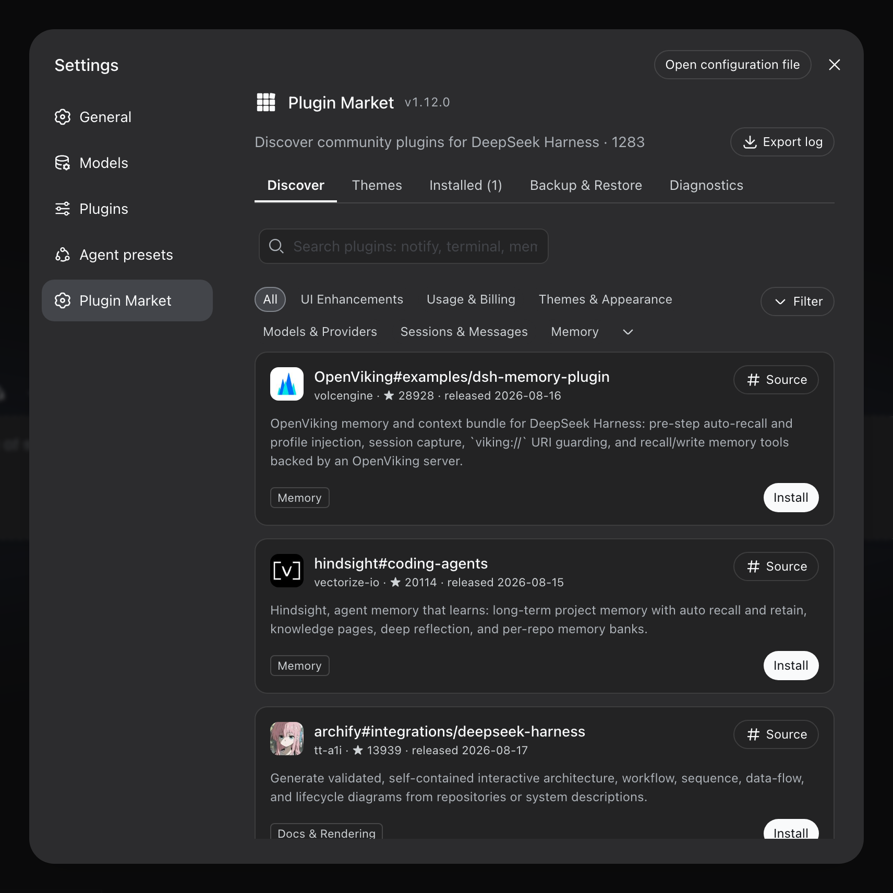
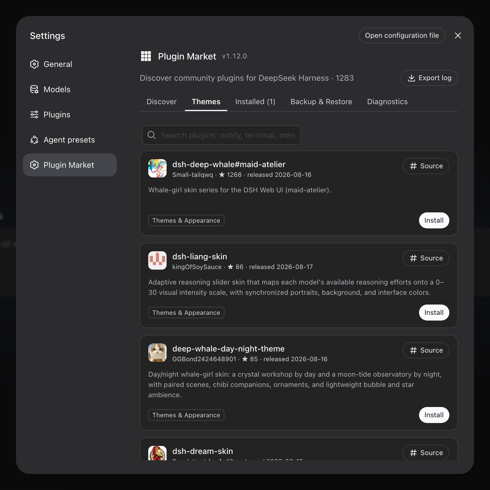

<p align="center">
  
</p>

# dshhub-market

English | [中文](README.zh.md)

[](https://www.npmjs.com/package/dshhub-market)
[](https://github.com/dshhub/dshhub-market)
[](https://github.com/dshhub/dshhub-market/actions/workflows/ci.yml)

The plugin market inside DeepSeek Harness, powered by [DSHHub.co](https://www.dshhub.co) — browse, search, one-click install community plugins from Settings → **Plugin Market**.

> A maintained fork of [dsh-market/dsh-market](https://github.com/dsh-market/dsh-market) (MIT): same market engine, rebranded and wired to the DSHHub.co catalog and update channel. See [UPSTREAM.md](UPSTREAM.md) for the fork record.

> **Not recommended, not supported: `anywhere-labs/deepseek-harness-desktop` — nor will we deliberately support protocols it unilaterally requires, or ask plugins listed in this market to adapt to them.** Use [dsh-desktop](https://github.com/dataelement/dsh-desktop) or [deepseek-harness-desktop](https://github.com/hairyf/deepseek-harness-desktop), or another excellent third-party client.



One-click themes — install, switch live, no restart:



## Install

From npm:

```sh
dsh plugin --profile web add dshhub-market
```

Or directly from DSHHub.co:

```sh
dsh plugin --profile web add https://www.dshhub.co/dshhub-market.tgz
```

Restart `dsh web`, then open **Settings → Plugin Market**.

**Requires dsh web 0.1.0-rc.6 or newer.** On an older host the market
disables itself and says so in the browser console rather than rendering
against primitives that are not there — if the Plugin Market entry never
appears, that is usually why. Worth checking when a desktop build bundles
its own dsh: it may be older than the one `npm` would give you.

## What you get

- **Browse & search** the community catalog — category filters, star counts, top/new sorting, bilingual descriptions that follow your UI language
- **Screenshots** — AppStore-style screenshots in the install dialog: author-curated via the registry, with automatic README extraction as fallback; images load from GitHub hosting only, and only after you open the dialog
- **Themes** — a dedicated tab for community themes and skins: install → active immediately, switch with one click (themes are mutually exclusive, your choice survives restarts), uninstall to revert
- **One-click install** — confirm the source, watch live progress; most plugins go live after a page refresh, no restart
- **Backup & restore** — export your profile's plugin list and configuration as readable JSON, import it on another machine, store it on WebDAV with daily auto-backup, or sync through a private GitHub Gist; restores **merge** (plugins installed after the backup are kept), validate before writing, and roll back on failure
- **Updates** — per-plugin update checks (npm version or pinned commit vs HEAD), one-click update, or update everything at once; the market updates itself from the DSHHub.co release channel
- **Uninstall** — two-step confirm; plugins installed this session are removed live
- **Hot disable / enable** — toggles write `- id: …` + `disabled: true|false` into the profile's `cordis.patch.yml` (the official patch layer, mechanism ported from [dsh-plugin-hub](https://github.com/Noob-stupid/dsh-plugin-hub)): DSH's HMR re-composes within ~1s, no restart, and the loader re-applies the choice on every boot; hand-edited patch rows show as badges, host-infrastructure plugins are protected from toggling, and a malformed patch file is never made worse
- **Restart when needed** — changes that cannot hot-load show a one-click restart beside the pending-change banner; the action is restricted to same-origin loopback requests
- **Zero jargon** — if a component is missing (pnpm), the market detects it and offers a one-click automatic setup
- **Log export** — one click produces a sanitized plain-text log for bug reports (home paths and credential shapes are masked; nothing is ever sent anywhere). The market's version sits next to the page heading, so a screenshot of a problem already carries it
- **Settings card** — on dsh 0.1.0-rc.7 and newer the market manages *itself* from **Settings → Plugins → Plugin configuration**, next to every other plugin: see the running version, pick a **release channel** (stable, or beta to try builds still being verified — the market only, never your other plugins), update, or remove the market — with an opt-in cleanup that also drops the disable rows it wrote, so plugins it switched off start running again rather than staying off with no UI left to switch them back on
- **Diagnostics** — the plugin load order and conflict surface, one page: bundle stack with official/community badges, duplicate loader entries, dependency version mismatches, multi-version core packages, overrides and invalid config entries. Plain-language terms, problem blocks highlighted, everything collapsible
- **Load order** — drag community bundles into the order you want, or take the suggested one derived from the plugins' own before/after rules. Nothing is written until a trial composition passes, and the panel tells you what the new order would change (overrides, invalid or duplicate entries) before you apply it
- **AI fix** — one click copies a diagnostics-driven fix prompt (errors/warnings/order conflicts + conservative scope instructions) to the clipboard; you paste it into a new conversation and decide whether to send
- **DSHHub.co integration** — paid plugins download with your DSHHub account token, and a local bridge lets the DSHHub.co website trigger one-click installs straight into this DSH profile

## Speed

Installs prefer npm tarballs over full-repo GitHub downloads whenever a plugin publishes to npm (registry-verified against the repo to prevent name squatting). Registry installs are typically seconds; GitHub-only plugins depend on your connection to GitHub.

## Security

- Installs are restricted to sources listed in the DSHHub.co registry (a curated catalog merged from the [awesome-dsh-plugin](https://awesome-dsh-plugin.com) list plus DSHHub uploads) — anything else is rejected
- Build scripts stay blocked by default (pnpm ≥10); allowing one is your explicit per-package choice
- Terminal/CLI-surface plugins are flagged before you install them into the web profile
- The install endpoint accepts same-origin POST only; the market never phones home
- The local bridge used by the DSHHub.co website accepts requests from loopback and dshhub.co origins only
- Backups can contain credentials from your profile config — the UI warns before export and upload; WebDAV sync is https-only, refuses private-network targets, and never stores your password in the browser
- The restart endpoint additionally requires a direct loopback client (forwarded requests are rejected) and relaunches the exact DSH entry, arguments, environment, and working directory
- One-click restart launches a detached replacement. If DSH is managed by systemd, launchd, pm2, or another supervisor, set the plugin option `allowRestart: false` and let the supervisor own restarts instead; the pending-change notice remains visible but the button is hidden
- For terminal-attached launches, the detached replacement keeps running after the original terminal closes
- Listing ≠ endorsement: plugins are third-party code, install sources you trust

## Submit your plugin

**This repo is the market app, not the catalog.** The plugin list is served by [DSHHub.co](https://www.dshhub.co) — register an account and upload your plugin there. (The catalog merges the curated [awesome-dsh-plugin](https://github.com/awesome-dsh-plugin/awesome-dsh-plugin) list with DSHHub uploads.) Please don't PR plugin entries against this repo.

## Fork

This is a fork of [dsh-market/dsh-market](https://github.com/dsh-market/dsh-market) (MIT license, copyright retained). Differences: rebranded as `dshhub-market`, registry default and self-update channel point at [DSHHub.co](https://www.dshhub.co), added a zip install channel, a local install bridge for the website, and DSHHub account-token downloads for paid plugins. The full change list and resync procedure live in [UPSTREAM.md](UPSTREAM.md).

## Roadmap & feedback

- **Bugs** go in [issues](https://github.com/dshhub/dshhub-market/issues) — attaching the market's "Export log" makes diagnosis roughly ten times faster
- Feature ideas welcome as issues too — say so before starting a big PR, so two people don't build it twice

## Data source

Live from [www.dshhub.co/api/registry/plugins.json](https://www.dshhub.co/api/registry/plugins.json) — the merged DSHHub catalog, refreshed by the platform — with a bundled snapshot as offline fallback.

## Friends

### DSH Desktop (dataelement)

[dsh-desktop](https://github.com/dataelement/dsh-desktop) — a desktop app for DeepSeek Harness: run and manage a local Harness without installing Node.js yourself.

### DeepSeek Harness Desktop (hairyf)

[deepseek-harness-desktop](https://github.com/hairyf/deepseek-harness-desktop) — a native desktop app for DeepSeek Harness built with **Tauri** (Rust + Web).

### DSH Get

[DSH Get](https://www.dshget.com/) — a searchable web directory for discovering DeepSeek Harness plugins.

### dsh-market (upstream)

[dsh-market](https://github.com/dsh-market/dsh-market) — the original market this project is forked from.

## License

MIT · fork of [dsh-market](https://github.com/dsh-market/dsh-market) · [dshhub.co](https://www.dshhub.co)
